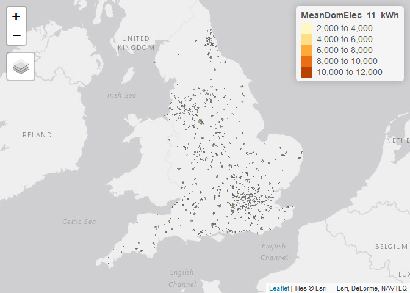

Interview Areas
================
Malcolm Morgan
3 July 2019

Setup
-----

Input data
----------

First load the data, some in England and Wales only so we will start with just there.

We will subsets the data and join together

Step 1: Top 30% of Gas, Electricity, or Driving
-----------------------------------------------

### Gas

Deciles for mean gas consuption per capita (kWh)

    ##     10%     20%     30%     40%     50%     60%     70%     80%     90% 
    ## 10723.0 11724.0 12469.0 13170.0 13873.0 14601.0 15451.0 16609.0 18529.6

### Electric

Deciles for mean electric consuption per capita (kWh)

    ##  10%  20%  30%  40%  50%  60%  70%  80%  90% 
    ## 3263 3476 3637 3771 3910 4058 4252 4560 5228

### Driving

Decile for miles driven in cars per capita

    ##       10%       20%       30%       40%       50%       60%       70% 
    ##  3275.071  4324.597  5136.685  5876.352  6577.987  7305.681  8115.826 
    ##       80%       90% 
    ##  9083.648 10403.133

No filter areas that are in top 30% for at least one category

Just under 50% of LSOAs are in the top 30% for at least one variable.

Step 2: Rural Urban
-------------------

Rural Urban Classifications:

    ##                           Rural town and fringe 
    ##                                            3189 
    ##       Rural town and fringe in a sparse setting 
    ##                                             197 
    ##                     Rural village and dispersed 
    ##                                            2490 
    ## Rural village and dispersed in a sparse setting 
    ##                                             328 
    ##                             Urban city and town 
    ##                                           15724 
    ##         Urban city and town in a sparse setting 
    ##                                              94 
    ##                         Urban major conurbation 
    ##                                           11523 
    ##                         Urban minor conurbation 
    ##                                            1208

Filter out rural areas, now down to 33% of LSOAs

Step 3: Accessibility Indicators
--------------------------------

Using the DFT accessibility statistics to filter out areas where less than 50% of people are within 15 minutes of the town centre by walking or public transport.

Now down to 23 % of LSOAs

Step 4: Building Energy Efficiency
----------------------------------

Filter out areas with below average EPC ratings. The current EPC deciles are:

    ##      10%      20%      30%      40%      50%      60%      70%      80% 
    ## 57.11758 59.63857 61.27018 62.58283 63.81570 65.10222 66.48845 68.21613 
    ##      90% 
    ## 70.89227

Down to 9.5% of LSOAs, so let's look at where we are.

Summary of areas.
-----------------

A quick map, we have quite a good geographic spread. See an interactive map at <https://www.wisemover.co.uk/creds/>

    ## Warning: Column `LSOA11` joining character vector and factor, coercing into
    ## character vector

