Modeling spatial variation in energy use
================
Malcolm Morgan
11 June 2019

## Setup

bringing in the basic settings we need for R.

## Input data

First load the data, some is in England and Wales only so we will start
with just there. The datasets in use are:

1.  LSOA boundaries
2.  Annual Gas & Electricity domestic usage for LSOA
3.  2011 MOT data for miles driven by car (also have vans but not using)
4.  Building age (based on counts of bands but estimating mean age)
5.  Basic census demographics and building types (e.g. semi-detached)
6.  Heating types from census
7.  EPC average score (aggregated up from OA)
8.  Population counts and population density
9.  Number of rooms/bedrooms from census
10. Average emissions factors for driving

We will subsets the data and join together into a single master table.
When possible converting values to percentages to aid comparison and
prevent model distortions.

## Examining Correlations

Before getting into the detail lets Let see which variables are
correlated with energy use. This gives an overall idea of what matters.

### Gas

A table of the top correlations, showing persons R and P-values.
Correlating with 2011 gas consumption as most data (e.g. census if from
that year)

    ##                                  R  P
    ## SocGrade_DE.            -0.5639508  0
    ## NoCarsHH                -0.5361904  0
    ## miles_percap             0.5293108  0
    ## Whole_House_Detached.    0.5448550  0
    ## Self.Emp.                0.5490101  0
    ## TotDomGas_17_kWh         0.5555530  0
    ## TotDomGas_11_kWh         0.5595345  0
    ## X4plusCarHH.             0.5746058  0
    ## T2W_Home.                0.5819583  0
    ## X2CarHH.                 0.5860884  0
    ## Outright.                0.5998159  0
    ## median_household_income  0.6014278  0
    ## cars_percap              0.6019325  0
    ## X3CarHH.                 0.6153954  0
    ## SocGrade_AB.             0.6333509  0
    ## MeanDomElec_17_kWh       0.6604744  0
    ## MeanDomElec_11_kWh       0.6657689  0
    ## mean_bedrooms            0.7118405  0
    ## mean_rooms               0.7390212  0
    ## MeanDomGas_17_kWh        0.9806321  0
    ## MeanDomGas_11_kWh        1.0000000 NA

The strongest correlation is with the number of rooms. This is
unsurprising as bigger houses require more heating. The next strongest
correlation is with the number of bedrooms, but as the number of
bedrooms is closely related to the number of rooms this is not very
informative.

Other strong correlations are % of AB social grade people being strongly
positive and % DE Social grade people being strongly negative. Also note
that working from home and being self-employed is predictive of higher
gas usage, perhaps showing households that are heated all day?

We could try a model of the top 5
variaibles

``` r
#gas_lm0 = lm(MeanDomGas_11_kWh ~ mean_rooms + SocGrade_DE. + mean_bedrooms + SocGrade_AB. + median_household_income, data=all, na.action = na.exclude)
# summary(gas_lm0)
```

It would be more interesting to remove the effect of the number of rooms
and see what is strongly correlated with the residuals.

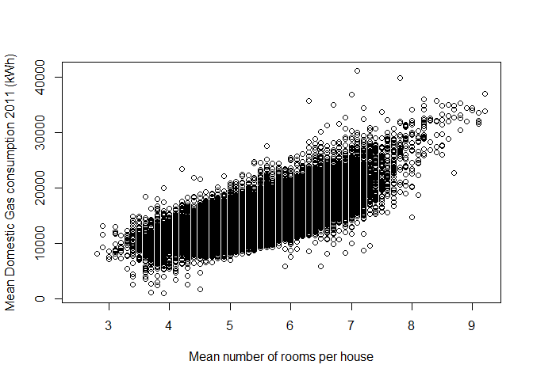<!-- -->

Let’s look at what best predicts the residuals after accounting for the
number of rooms.

    ## 
    ## Call:
    ## lm(formula = MeanDomGas_11_kWh ~ mean_rooms, data = all, na.action = na.exclude)
    ## 
    ## Residuals:
    ##      Min       1Q   Median       3Q      Max 
    ## -11862.3  -1503.8   -180.6   1245.3  21476.6 
    ## 
    ## Coefficients:
    ##             Estimate Std. Error t value Pr(>|t|)    
    ## (Intercept) -2695.61      87.22  -30.91   <2e-16 ***
    ## mean_rooms   3135.21      15.87  197.50   <2e-16 ***
    ## ---
    ## Signif. codes:  0 '***' 0.001 '**' 0.01 '*' 0.05 '.' 0.1 ' ' 1
    ## 
    ## Residual standard error: 2269 on 32413 degrees of freedom
    ##   (2338 observations deleted due to missingness)
    ## Multiple R-squared:  0.5462, Adjusted R-squared:  0.5461 
    ## F-statistic: 3.901e+04 on 1 and 32413 DF,  p-value: < 2.2e-16

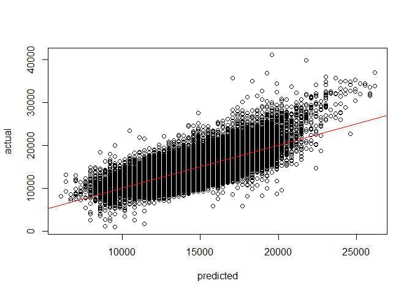<!-- -->

    ## Warning in sqrt(1 - h * h): NaNs produced

    ##                                  R  P
    ## SocGrade_C2.            -0.4422558  0
    ## PartTime.               -0.4161821  0
    ## Ptn_EE                  -0.3625546  0
    ## T2W_Passenger.          -0.3382974  0
    ## p5_12k                  -0.3311907  0
    ## mean_house_age          -0.3300233  0
    ## T2W_Car.                -0.3030392  0
    ## T2W_Train.               0.3010667  0
    ## Flat_Converted.          0.3018297  0
    ## pu5k                     0.3179919  0
    ## petrol_co2               0.3208661  0
    ## Self.Emp.                0.3297608  0
    ## T2W_Metro.               0.3357659  0
    ## median_household_income  0.3576429  0
    ## SocGrade_AB.             0.3728166  0
    ## diesel_co2               0.3841835  0
    ## TotDomGas_17_kWh         0.4425404  0
    ## TotDomGas_11_kWh         0.4904878  0
    ## MeanDomGas_17_kWh        0.6487635  0
    ## MeanDomGas_11_kWh        0.6736821  0
    ## gas_lm1_res              1.0000000 NA

Some of these are more related to car use (e.g. T2W\_Car is the % of
people travelling to work by car). Of the ones about houses,
SocialGrade\_C2 is the strongest correlation. This is interesting as it
seems that by accounting for the number of rooms we have removed some
but not all the of the social grade effect. Could C2 class people be
slightly different from the other social classes?

Plots of the relationship between the proportion of people with class C2
and gas consumption. And the correlation between residuals for the model
and social grade
C2.

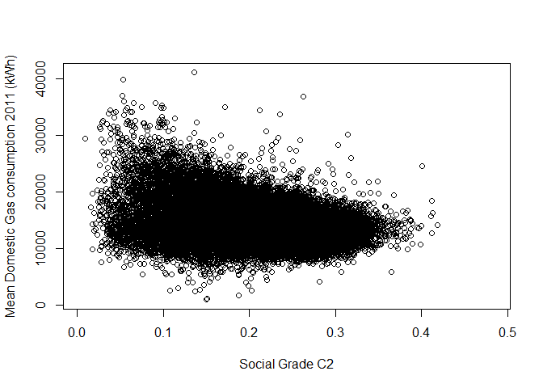<!-- -->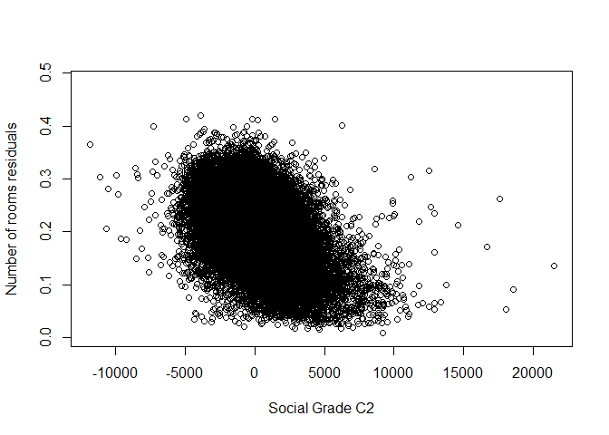<!-- -->

So let try a new model with the two variables. This improved the model
from an R squared of 0.54 to 0.63

    ## 
    ## Call:
    ## lm(formula = MeanDomGas_11_kWh ~ mean_rooms + SocGrade_C2., data = all, 
    ##     na.action = na.exclude)
    ## 
    ## Residuals:
    ##      Min       1Q   Median       3Q      Max 
    ## -10705.8  -1307.9    -41.5   1215.1  20359.5 
    ## 
    ## Coefficients:
    ##               Estimate Std. Error t value Pr(>|t|)    
    ## (Intercept)     997.95      88.57   11.27   <2e-16 ***
    ## mean_rooms     3079.50      14.25  216.13   <2e-16 ***
    ## SocGrade_C2. -16040.29     180.47  -88.88   <2e-16 ***
    ## ---
    ## Signif. codes:  0 '***' 0.001 '**' 0.01 '*' 0.05 '.' 0.1 ' ' 1
    ## 
    ## Residual standard error: 2035 on 32412 degrees of freedom
    ##   (2338 observations deleted due to missingness)
    ## Multiple R-squared:  0.6351, Adjusted R-squared:  0.6351 
    ## F-statistic: 2.821e+04 on 2 and 32412 DF,  p-value: < 2.2e-16

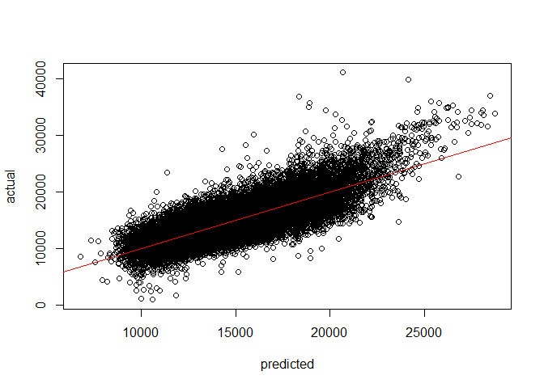<!-- -->

We can repeat the process, of looking at the residuals.

    ## Warning in sqrt(1 - h * h): NaNs produced

    ##                             R  P
    ## Crr_EE             -0.2715051  0
    ## mean_house_age     -0.2480263  0
    ## p1993_99           -0.2224963  0
    ## p1983_92           -0.2139817  0
    ## Ptn_EE             -0.2061434  0
    ## pu5k                0.2087189  0
    ## MeanDomElec_11_kWh  0.2288647  0
    ## p1930_39            0.2330090  0
    ## MeanDomElec_17_kWh  0.2457997  0
    ## Self.Emp.           0.2507481  0
    ## diesel_co2          0.2636262  0
    ## TotDomGas_17_kWh    0.3593443  0
    ## TotDomGas_11_kWh    0.4049770  0
    ## MeanDomGas_17_kWh   0.5701297  0
    ## MeanDomGas_11_kWh   0.6040756  0
    ## gas_lm1_res         0.8966774  0
    ## gas_lm2_res         1.0000000 NA

Hear some other appropriate variables such as the EPC rating (Crr\_EE)
and building age (mean\_house\_age) stand out as we the proportion of
self-employed people.

Let try a final model with all these added variables.

    ## 
    ## Call:
    ## lm(formula = MeanDomGas_11_kWh ~ mean_rooms + SocGrade_C2. + 
    ##     Crr_EE + Self.Emp. + mean_house_age, data = all, na.action = na.exclude)
    ## 
    ## Residuals:
    ##    Min     1Q Median     3Q    Max 
    ## -12473  -1171    -24   1099  18576 
    ## 
    ## Coefficients:
    ##                  Estimate Std. Error t value Pr(>|t|)    
    ## (Intercept)     1.883e+04  8.855e+02   21.26   <2e-16 ***
    ## mean_rooms      2.586e+03  1.782e+01  145.14   <2e-16 ***
    ## SocGrade_C2.   -1.331e+04  1.793e+02  -74.28   <2e-16 ***
    ## Crr_EE         -9.029e+01  2.911e+00  -31.02   <2e-16 ***
    ## Self.Emp.       1.433e+02  3.255e+00   44.03   <2e-16 ***
    ## mean_house_age -5.807e+00  5.305e-01  -10.95   <2e-16 ***
    ## ---
    ## Signif. codes:  0 '***' 0.001 '**' 0.01 '*' 0.05 '.' 0.1 ' ' 1
    ## 
    ## Residual standard error: 1879 on 32409 degrees of freedom
    ##   (2338 observations deleted due to missingness)
    ## Multiple R-squared:  0.689,  Adjusted R-squared:  0.6889 
    ## F-statistic: 1.436e+04 on 5 and 32409 DF,  p-value: < 2.2e-16

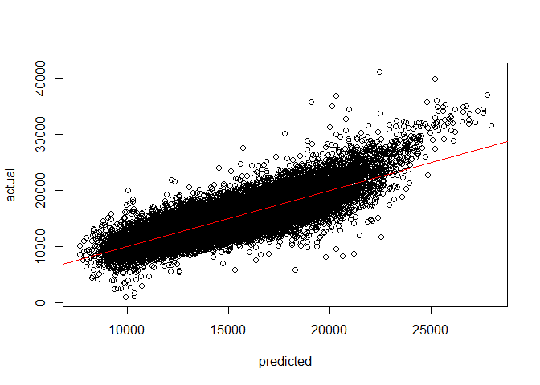<!-- -->

So we have a model that can explain 68.9% of the variation in gas usage
at LSOA level based on just 5 variables. Gas is tricky due to the
off-gas grid areas which we have not properly captured, although the
type of heating has not been very predictive.

### Kitchen Sink Approach

Let’s throw the kitchen sink at the data that is even slightly
correlated and see what is the best model we can get.

## Electricity

Let’s do the same for electricity.

``` r
all_matrix <- all[,2:ncol(all)]
all_matrix <- data.matrix(all_matrix)

correlations <- rcorr(x = all_matrix, type="pearson")
```

    ## Warning in sqrt(1 - h * h): NaNs produced

``` r
correlations_elec <- data.frame(R = correlations$r[,"MeanDomElec_11_kWh"], P = correlations$P[,"MeanDomElec_11_kWh"])
correlations_elec <- correlations_elec[order(correlations_elec$R),]
correlations_elec <- correlations_elec[correlations_elec$R > 0.5 | correlations_elec$R < -0.5,]
correlations_elec
```

    ##                                  R          P
    ## NoCarsHH                -0.5585555 0.00000000
    ## pHeating_Gas            -0.5393354 0.00000000
    ## SocGrade_DE.            -0.5012241 0.00000000
    ## diesel_co2               0.5088461 0.00000000
    ## median_household_income  0.5121404 0.00000000
    ## petrol_emissions         0.5464714 0.00000000
    ## petrol_litres            0.5464714 0.00000000
    ## diesel_kwh               0.5464714 0.00000000
    ## petrol_kwh               0.5464714 0.00000000
    ## driving_kwh              0.5464714 0.00000000
    ## cars_total               0.5502318 0.00000000
    ## cars_miles               0.5549160 0.00000000
    ## electric diesel_n        0.5707371 0.00445412
    ## pHeating_Other           0.5834652 0.00000000
    ## driving_kwh_percap       0.5925354 0.00000000
    ## Whole_House_Detached.    0.6017017 0.00000000
    ## TotDomElec_17_kWh        0.6059113 0.00000000
    ## mean_bedrooms            0.6144301 0.00000000
    ## X2CarHH.                 0.6153940 0.00000000
    ## diesel_litres            0.6260853 0.00000000
    ## diesel_emissions         0.6260853 0.00000000
    ## TotDomElec_11_kWh        0.6265141 0.00000000
    ## cars_percap              0.6415059 0.00000000
    ## miles_percap             0.6415382 0.00000000
    ## Self.Emp.                0.6582675 0.00000000
    ## MeanDomGas_17_kWh        0.6592434 0.00000000
    ## MeanDomGas_11_kWh        0.6657689 0.00000000
    ## mean_rooms               0.6714863 0.00000000
    ## T2W_Home.                0.7067935 0.00000000
    ## X3CarHH.                 0.7274470 0.00000000
    ## X4plusCarHH.             0.7578176 0.00000000
    ## MeanDomElec_17_kWh       0.9618235 0.00000000
    ## MeanDomElec_11_kWh       1.0000000         NA

Here we see the top factors are (excluding car related ones) Number of
rooms, Self Employed, and % gas heating, detached houses, and % other
heating. Again income matters but is not the top variable. That gas
heating reduces electricity demand is clear, but why does electric
heating not increase demand? A simple model based on a few top variables
gets an R squared of
0.74.

``` r
elec_lm0 = lm(MeanDomElec_11_kWh ~ mean_rooms + Self.Emp. + pHeating_Gas + Whole_House_Detached. + pHeating_Other, 
              data=all, na.action = na.exclude)
summary(elec_lm0)
```

    ## 
    ## Call:
    ## lm(formula = MeanDomElec_11_kWh ~ mean_rooms + Self.Emp. + pHeating_Gas + 
    ##     Whole_House_Detached. + pHeating_Other, data = all, na.action = na.exclude)
    ## 
    ## Residuals:
    ##     Min      1Q  Median      3Q     Max 
    ## -5122.7  -246.4   -22.1   211.9 13043.5 
    ## 
    ## Coefficients:
    ##                        Estimate Std. Error t value Pr(>|t|)    
    ## (Intercept)           2852.3637    30.6036   93.20   <2e-16 ***
    ## mean_rooms             729.0320     5.5752  130.76   <2e-16 ***
    ## Self.Emp.               48.5739     0.7518   64.61   <2e-16 ***
    ## pHeating_Gas           -37.4653     0.3477 -107.74   <2e-16 ***
    ## Whole_House_Detached.   -1.7549     0.1895   -9.26   <2e-16 ***
    ## pHeating_Other         -29.3248     0.4942  -59.34   <2e-16 ***
    ## ---
    ## Signif. codes:  0 '***' 0.001 '**' 0.01 '*' 0.05 '.' 0.1 ' ' 1
    ## 
    ## Residual standard error: 442.9 on 33836 degrees of freedom
    ##   (911 observations deleted due to missingness)
    ## Multiple R-squared:  0.7423, Adjusted R-squared:  0.7423 
    ## F-statistic: 1.95e+04 on 5 and 33836 DF,  p-value: < 2.2e-16

What about the residuals after accounting for the number of
rooms?

``` r
elec_lm1 = lm(MeanDomElec_11_kWh ~ mean_rooms, data=all, na.action = na.exclude)
summary(elec_lm1)
```

    ## 
    ## Call:
    ## lm(formula = MeanDomElec_11_kWh ~ mean_rooms, data = all, na.action = na.exclude)
    ## 
    ## Residuals:
    ##     Min      1Q  Median      3Q     Max 
    ## -4467.4  -418.9  -124.8   254.6 13927.4 
    ## 
    ## Coefficients:
    ##             Estimate Std. Error t value Pr(>|t|)    
    ## (Intercept)  141.716     24.001   5.905 3.57e-09 ***
    ## mean_rooms   723.225      4.339 166.696  < 2e-16 ***
    ## ---
    ## Signif. codes:  0 '***' 0.001 '**' 0.01 '*' 0.05 '.' 0.1 ' ' 1
    ## 
    ## Residual standard error: 646.5 on 33840 degrees of freedom
    ##   (911 observations deleted due to missingness)
    ## Multiple R-squared:  0.4509, Adjusted R-squared:  0.4509 
    ## F-statistic: 2.779e+04 on 1 and 33840 DF,  p-value: < 2.2e-16

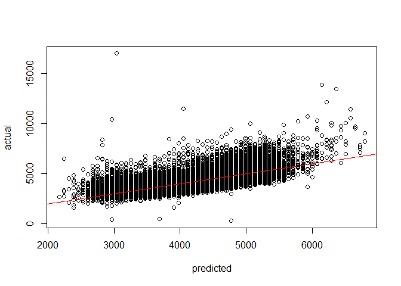<!-- -->

    ## Warning in sqrt(1 - h * h): NaNs produced

    ##                             R          P
    ## pHeating_Gas       -0.6462009 0.00000000
    ## GasMet_11          -0.3454391 0.00000000
    ## Ptn_EE             -0.3285758 0.00000000
    ## GasMet_17          -0.3268685 0.00000000
    ## T2W_Passenger.     -0.3042407 0.00000000
    ## area_km             0.3019049 0.00000000
    ## Area_Hectares       0.3019049 0.00000000
    ## gas_lm2_res         0.3035521 0.00000000
    ## X4plusCarHH.        0.3290875 0.00000000
    ## gas_lm1_res         0.3489583 0.00000000
    ## T2W_Home.           0.4180408 0.00000000
    ## electric diesel_n   0.4461611 0.03284649
    ## Self.Emp.           0.4495740 0.00000000
    ## pHeating_Other      0.4777340 0.00000000
    ## petrol_co2          0.5369849 0.00000000
    ## diesel_co2          0.5541189 0.00000000
    ## pHeating_Electric   0.5744553 0.00000000
    ## TotDomElec_17_kWh   0.5788952 0.00000000
    ## TotDomElec_11_kWh   0.5873605 0.00000000
    ## MeanDomElec_17_kWh  0.7123278 0.00000000
    ## MeanDomElec_11_kWh  0.7410170 0.00000000
    ## elec_lm1_res        1.0000000         NA

Here the number of rooms is much less predictive than for gas. This
suggests that other behaviours matter more than house size. Also, note
there is a lot less variation between LSOAs in terms of their
electricity usage.

The top residuals are % of different heating types, self-employed and
working from
home.

``` r
elec_lm2 = lm(MeanDomElec_11_kWh ~ mean_rooms + Self.Emp. + pHeating_Gas + pHeating_Electric + pHeating_Other + T2W_Home., 
              data=all, na.action = na.exclude)
summary(elec_lm2)
```

    ## 
    ## Call:
    ## lm(formula = MeanDomElec_11_kWh ~ mean_rooms + Self.Emp. + pHeating_Gas + 
    ##     pHeating_Electric + pHeating_Other + T2W_Home., data = all, 
    ##     na.action = na.exclude)
    ## 
    ## Residuals:
    ##     Min      1Q  Median      3Q     Max 
    ## -4970.8  -243.3   -25.8   208.3 12761.7 
    ## 
    ## Coefficients:
    ##                   Estimate Std. Error t value Pr(>|t|)    
    ## (Intercept)        12.8387    82.0284   0.157 0.875628    
    ## mean_rooms        676.5887     4.4479 152.114  < 2e-16 ***
    ## Self.Emp.          53.7831     1.1880  45.272  < 2e-16 ***
    ## pHeating_Gas       -5.3740     0.9104  -5.903 3.61e-09 ***
    ## pHeating_Electric  38.0635     0.9966  38.194  < 2e-16 ***
    ## pHeating_Other      6.4630     1.0600   6.097 1.09e-09 ***
    ## T2W_Home.          -7.5070     2.2616  -3.319 0.000903 ***
    ## ---
    ## Signif. codes:  0 '***' 0.001 '**' 0.01 '*' 0.05 '.' 0.1 ' ' 1
    ## 
    ## Residual standard error: 434.1 on 33835 degrees of freedom
    ##   (911 observations deleted due to missingness)
    ## Multiple R-squared:  0.7524, Adjusted R-squared:  0.7524 
    ## F-statistic: 1.714e+04 on 6 and 33835 DF,  p-value: < 2.2e-16

We can get an R squared of 0.75 which is probably pushing the upper
limit of what is possible, considering the quality of the data and that
there will be some inherent randomness.

## Driving

Finally, let’s look at driving. The top correlations are.

    ## Warning in sqrt(1 - h * h): NaNs produced

    ##                                R           P
    ## NoCarsHH              -0.8863509 0.000000000
    ## Unemployed.           -0.6366630 0.000000000
    ## Occupancy_Rooms.      -0.6366251 0.000000000
    ## T2W_Bus.              -0.6327583 0.000000000
    ## Unemp_LongTerm.       -0.6060022 0.000000000
    ## dense_2017            -0.6010782 0.000000000
    ## PopDens               -0.5971902 0.000000000
    ## dense_2011            -0.5968010 0.000000000
    ## Flat_PurposeBuilt.    -0.5911419 0.000000000
    ## Age25to29.            -0.5861809 0.000000000
    ## pu5k                  -0.5797919 0.000000000
    ## SocGrade_DE.          -0.5600010 0.000000000
    ## Occupancy_Bedrooms.   -0.5589965 0.000000000
    ## Sick.                 -0.5522231 0.000000000
    ## Unemp_NeverWorked.    -0.5451175 0.000000000
    ## Unemp_16to24.         -0.5004581 0.000000000
    ## MeanDomGas_17_kWh      0.5134831 0.000000000
    ## Age_Median             0.5251467 0.000000000
    ## MeanDomGas_11_kWh      0.5293108 0.000000000
    ## electric diesel_n      0.5301136 0.006415933
    ## Age60to64.             0.5503497 0.000000000
    ## T2W_Home.              0.5620300 0.000000000
    ## pmiles_diesel          0.5674552 0.000000000
    ## MeanDomElec_17_kWh     0.5906773 0.000000000
    ## pcars_diesel           0.5911316 0.000000000
    ## po12k                  0.5996106 0.000000000
    ## miles_av_o13           0.6069242 0.000000000
    ## Mortgage.              0.6146913 0.000000000
    ## Outright.              0.6219956 0.000000000
    ## Age45to59.             0.6369953 0.000000000
    ## MeanDomElec_11_kWh     0.6415382 0.000000000
    ## petrol_n               0.6720132 0.000000000
    ## diesel_n               0.6802140 0.000000000
    ## all_cars_n             0.7152079 0.000000000
    ## Whole_House_Detached.  0.7678345 0.000000000
    ## mean_bedrooms          0.7720605 0.000000000
    ## T2W_Car.               0.7780529 0.000000000
    ## X4plusCarHH.           0.7900675 0.000000000
    ## petrol_kwh             0.8179661 0.000000000
    ## petrol_litres          0.8179661 0.000000000
    ## diesel_kwh             0.8179661 0.000000000
    ## petrol_emissions       0.8179661 0.000000000
    ## driving_kwh            0.8179661 0.000000000
    ## cars_total             0.8247643 0.000000000
    ## diesel_emissions       0.8287310 0.000000000
    ## diesel_litres          0.8287310 0.000000000
    ## mean_rooms             0.8304508 0.000000000
    ## cars_miles             0.8715446 0.000000000
    ## X3CarHH.               0.8811794 0.000000000
    ## driving_kwh_percap     0.9128796 0.000000000
    ## X2CarHH.               0.9225223 0.000000000
    ## cars_percap            0.9547231 0.000000000
    ## miles_percap           1.0000000          NA

The top correlations are quite broad but include household without cars,
unemployment, and population density, car ownership per capita, number
of rooms and bedrooms, and % travel to work by
car.

``` r
cars_lm0 = lm(miles_percap ~ cars_percap + T2W_Car. + NoCarsHH + Unemployed. + dense_2011, 
              data=all, na.action = na.exclude)
summary(cars_lm0)
```

    ## 
    ## Call:
    ## lm(formula = miles_percap ~ cars_percap + T2W_Car. + NoCarsHH + 
    ##     Unemployed. + dense_2011, data = all, na.action = na.exclude)
    ## 
    ## Residuals:
    ##     Min      1Q  Median      3Q     Max 
    ## -3640.0  -471.3   -44.8   411.6  4827.7 
    ## 
    ## Coefficients:
    ##               Estimate Std. Error t value Pr(>|t|)    
    ## (Intercept) -2.435e+03  5.962e+01 -40.836  < 2e-16 ***
    ## cars_percap  7.912e+03  3.237e+01 244.410  < 2e-16 ***
    ## T2W_Car.     3.646e+01  6.347e-01  57.448  < 2e-16 ***
    ## NoCarsHH     2.129e+01  8.932e-01  23.838  < 2e-16 ***
    ## Unemployed.  1.933e+01  2.612e+00   7.402 1.37e-13 ***
    ## dense_2011  -2.303e-02  1.299e-03 -17.729  < 2e-16 ***
    ## ---
    ## Signif. codes:  0 '***' 0.001 '**' 0.01 '*' 0.05 '.' 0.1 ' ' 1
    ## 
    ## Residual standard error: 757.7 on 34747 degrees of freedom
    ## Multiple R-squared:  0.923,  Adjusted R-squared:  0.923 
    ## F-statistic: 8.327e+04 on 5 and 34747 DF,  p-value: < 2.2e-16

``` r
plot(all$cars_percap, all$miles_percap,
     xlab="Cars per person",ylab="Miles per person",
     xlim = c(0,2), ylim = c(0,20000))
```

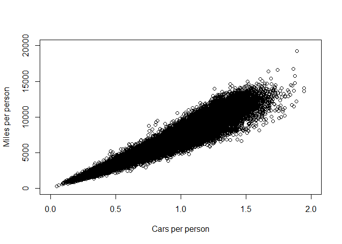<!-- -->

``` r
plot(predict(cars_lm0),all$miles_percap,
     xlab="predicted",ylab="actual", xlim = c(0,20000), ylim = c(0,20000))
abline(a=0,b=1, col = "red")
```

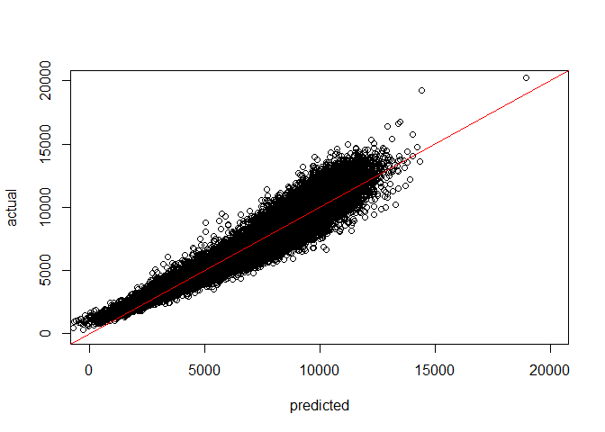<!-- -->

There is a very strong correlation between cars per person and miles
driven per person, suggesting that a car owner is a car driven. It is
perhaps unsurprising that people do not own a lot of cars they don’t
need, conversely it is impossible to drive a non-existent car. So let’s
remove the car ownership to get a clearer idea of what else
matters.

``` r
cars_lm1 = lm(miles_percap ~  T2W_Car. + NoCarsHH + Unemployed. + dense_2011, 
              data=all, na.action = na.exclude)
summary(cars_lm1)
```

    ## 
    ## Call:
    ## lm(formula = miles_percap ~ T2W_Car. + NoCarsHH + Unemployed. + 
    ##     dense_2011, data = all, na.action = na.exclude)
    ## 
    ## Residuals:
    ##    Min     1Q Median     3Q    Max 
    ##  -3971   -766   -176    586  96840 
    ## 
    ## Coefficients:
    ##               Estimate Std. Error  t value Pr(>|t|)    
    ## (Intercept)  9.492e+03  5.648e+01  168.051  < 2e-16 ***
    ## T2W_Car.     1.658e+01  1.038e+00   15.976  < 2e-16 ***
    ## NoCarsHH    -1.345e+02  1.032e+00 -130.397  < 2e-16 ***
    ## Unemployed.  2.511e+01  4.307e+00    5.832 5.53e-09 ***
    ## dense_2011  -3.329e-02  2.141e-03  -15.547  < 2e-16 ***
    ## ---
    ## Signif. codes:  0 '***' 0.001 '**' 0.01 '*' 0.05 '.' 0.1 ' ' 1
    ## 
    ## Residual standard error: 1249 on 34748 degrees of freedom
    ## Multiple R-squared:  0.7905, Adjusted R-squared:  0.7905 
    ## F-statistic: 3.279e+04 on 4 and 34748 DF,  p-value: < 2.2e-16

``` r
plot(predict(cars_lm1),all$miles_percap,
     xlab="predicted",ylab="actual", xlim = c(0,20000), ylim = c(0,20000))
abline(a=0,b=1, col = "red")
```

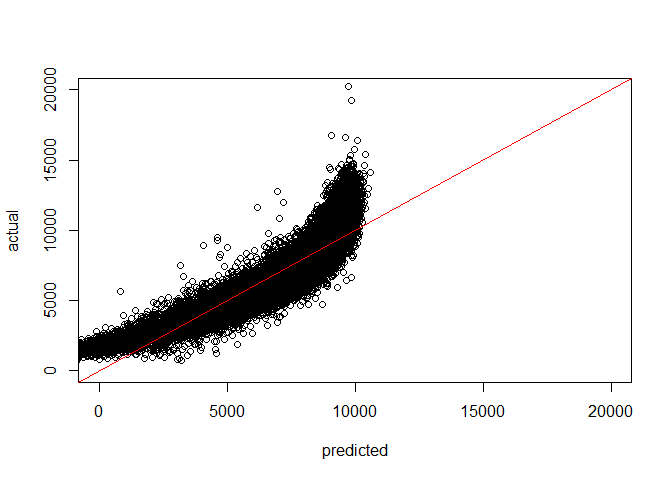<!-- -->

Still a reasonably good fit (R^2 of 0.79), but there is some clear
non-linerality to this relationship.

``` r
pairs(all[all$miles_percap < 30000,
          c("miles_percap", "T2W_Car.", "NoCarsHH" , "Unemployed.", "dense_2011")])
```

<!-- -->

It seems that density has a non-linear effect on driving.

``` r
plot(all$dense_2011, all$miles_percap,
     xlab="People per km ^2",ylab="Miles per person",
     ylim = c(0, 20000))
```

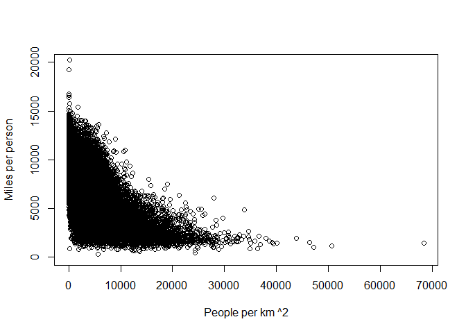<!-- -->

``` r
# fit non-linear model
cars_lm2a = lm(miles_percap ~  dense_2011, data=all, na.action = na.exclude)
cars_lm2b = nls(miles_percap ~ a * exp(b * dense_2011), data = all, start = list(a = 8000, b = -7e-5),
                na.action = na.exclude)
cars_lm2c = lm(miles_percap ~ exp(-7.25e-5 * dense_2011), data=all, na.action = na.exclude)
summary(cars_lm2a)
```

    ## 
    ## Call:
    ## lm(formula = miles_percap ~ dense_2011, data = all, na.action = na.exclude)
    ## 
    ## Residuals:
    ##    Min     1Q Median     3Q    Max 
    ##  -7445  -1466    -88   1375  96374 
    ## 
    ## Coefficients:
    ##               Estimate Std. Error t value Pr(>|t|)    
    ## (Intercept)  8.344e+03  1.656e+01   503.8   <2e-16 ***
    ## dense_2011  -3.888e-01  2.804e-03  -138.7   <2e-16 ***
    ## ---
    ## Signif. codes:  0 '***' 0.001 '**' 0.01 '*' 0.05 '.' 0.1 ' ' 1
    ## 
    ## Residual standard error: 2190 on 34751 degrees of freedom
    ## Multiple R-squared:  0.3562, Adjusted R-squared:  0.3562 
    ## F-statistic: 1.922e+04 on 1 and 34751 DF,  p-value: < 2.2e-16

``` r
summary(cars_lm2c)
```

    ## 
    ## Call:
    ## lm(formula = miles_percap ~ exp(-7.25e-05 * dense_2011), data = all, 
    ##     na.action = na.exclude)
    ## 
    ## Residuals:
    ##    Min     1Q Median     3Q    Max 
    ##  -8031  -1352    -29   1297  96093 
    ## 
    ## Coefficients:
    ##                             Estimate Std. Error t value Pr(>|t|)    
    ## (Intercept)                  -711.30      48.45  -14.68   <2e-16 ***
    ## exp(-7.25e-05 * dense_2011)  9683.36      61.38  157.76   <2e-16 ***
    ## ---
    ## Signif. codes:  0 '***' 0.001 '**' 0.01 '*' 0.05 '.' 0.1 ' ' 1
    ## 
    ## Residual standard error: 2084 on 34751 degrees of freedom
    ## Multiple R-squared:  0.4173, Adjusted R-squared:  0.4173 
    ## F-statistic: 2.489e+04 on 1 and 34751 DF,  p-value: < 2.2e-16

If we put that back into the original
model.

``` r
cars_lm3 = lm(miles_percap ~  T2W_Car. + NoCarsHH + Unemployed. +                  exp(-7.25e-5 * dense_2011), 
              data=all, na.action = na.exclude)
summary(cars_lm3)
```

    ## 
    ## Call:
    ## lm(formula = miles_percap ~ T2W_Car. + NoCarsHH + Unemployed. + 
    ##     exp(-7.25e-05 * dense_2011), data = all, na.action = na.exclude)
    ## 
    ## Residuals:
    ##    Min     1Q Median     3Q    Max 
    ##  -3789   -753   -176    573  96685 
    ## 
    ## Coefficients:
    ##                             Estimate Std. Error  t value Pr(>|t|)    
    ## (Intercept)                 7967.941     64.011  124.478  < 2e-16 ***
    ## T2W_Car.                      12.481      1.016   12.285  < 2e-16 ***
    ## NoCarsHH                    -129.086      1.013 -127.485  < 2e-16 ***
    ## Unemployed.                   21.968      4.208    5.221 1.79e-07 ***
    ## exp(-7.25e-05 * dense_2011) 1845.388     48.375   38.147  < 2e-16 ***
    ## ---
    ## Signif. codes:  0 '***' 0.001 '**' 0.01 '*' 0.05 '.' 0.1 ' ' 1
    ## 
    ## Residual standard error: 1228 on 34748 degrees of freedom
    ## Multiple R-squared:  0.7976, Adjusted R-squared:  0.7975 
    ## F-statistic: 3.422e+04 on 4 and 34748 DF,  p-value: < 2.2e-16

``` r
plot(predict(cars_lm3),all$miles_percap,
     xlab="predicted",ylab="actual", xlim = c(0,20000), ylim = c(0,20000))
abline(a=0,b=1, col = "red")
```

<!-- -->

It didn’t help very much :(

So try a polynomial on density and No car
households

``` r
cars_lm4 = lm(miles_percap ~  T2W_Car. + poly(NoCarsHH, 2) + Unemployed. + poly(dense_2011, 2), 
              data=all, na.action = na.exclude)
summary(cars_lm4)
```

    ## 
    ## Call:
    ## lm(formula = miles_percap ~ T2W_Car. + poly(NoCarsHH, 2) + Unemployed. + 
    ##     poly(dense_2011, 2), data = all, na.action = na.exclude)
    ## 
    ## Residuals:
    ##    Min     1Q Median     3Q    Max 
    ## -10454   -560    -37    488  97246 
    ## 
    ## Coefficients:
    ##                        Estimate Std. Error t value Pr(>|t|)    
    ## (Intercept)           5.754e+03  3.372e+01  170.66   <2e-16 ***
    ## T2W_Car.              1.368e+01  8.719e-01   15.69   <2e-16 ***
    ## poly(NoCarsHH, 2)1   -4.275e+05  2.647e+03 -161.51   <2e-16 ***
    ## poly(NoCarsHH, 2)2    1.169e+05  1.122e+03  104.16   <2e-16 ***
    ## Unemployed.           1.041e+02  3.676e+00   28.32   <2e-16 ***
    ## poly(dense_2011, 2)1 -4.334e+04  1.413e+03  -30.67   <2e-16 ***
    ## poly(dense_2011, 2)2  3.043e+04  1.122e+03   27.12   <2e-16 ***
    ## ---
    ## Signif. codes:  0 '***' 0.001 '**' 0.01 '*' 0.05 '.' 0.1 ' ' 1
    ## 
    ## Residual standard error: 1049 on 34746 degrees of freedom
    ## Multiple R-squared:  0.8523, Adjusted R-squared:  0.8523 
    ## F-statistic: 3.343e+04 on 6 and 34746 DF,  p-value: < 2.2e-16

``` r
plot(predict(cars_lm4),all$miles_percap,
     xlab="predicted",ylab="actual", xlim = c(0,20000), ylim = c(0,20000))
abline(a=0,b=1, col = "red")
```

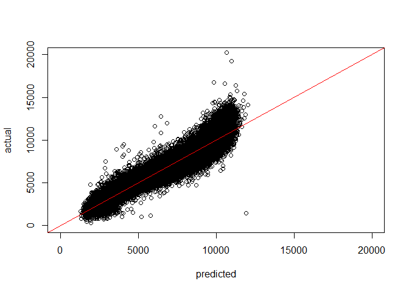<!-- -->

Much better but still seeing an S-bend to the data?

## Driving Energy consumption

How about looking at energy consumption rather than miles, does that
make a difference.

    ## Warning in sqrt(1 - h * h): NaNs produced

    ##                                R           P
    ## NoCarsHH              -0.8774011 0.000000000
    ## Unemployed.           -0.6526045 0.000000000
    ## Occupancy_Rooms.      -0.6499971 0.000000000
    ## T2W_Bus.              -0.6435850 0.000000000
    ## Occupancy_Bedrooms.   -0.6286443 0.000000000
    ## Unemp_NeverWorked.    -0.6163590 0.000000000
    ## Unemp_LongTerm.       -0.6107912 0.000000000
    ## dense_2017            -0.6074188 0.000000000
    ## PopDens               -0.6024421 0.000000000
    ## dense_2011            -0.6022379 0.000000000
    ## SocGrade_DE.          -0.5978420 0.000000000
    ## Age25to29.            -0.5793527 0.000000000
    ## Sick.                 -0.5627653 0.000000000
    ## T2W_NoEmp.            -0.5400353 0.000000000
    ## Unemp_16to24.         -0.5296169 0.000000000
    ## Flat_PurposeBuilt.    -0.5110838 0.000000000
    ## Age65to74.             0.5099993 0.000000000
    ## T2W_Home.              0.5339390 0.000000000
    ## Age_Mean               0.5456014 0.000000000
    ## MeanDomElec_17_kWh     0.5464581 0.000000000
    ## diesel_n               0.5754367 0.000000000
    ## electric diesel_n      0.5796084 0.002393144
    ## MeanDomElec_11_kWh     0.5925354 0.000000000
    ## Mortgage.              0.6067042 0.000000000
    ## Age60to64.             0.6088799 0.000000000
    ## Age_Median             0.6216460 0.000000000
    ## Outright.              0.6343436 0.000000000
    ## mean_bedrooms          0.6430301 0.000000000
    ## Age45to59.             0.6675512 0.000000000
    ## diesel_emissions       0.6947397 0.000000000
    ## diesel_litres          0.6947397 0.000000000
    ## all_cars_n             0.6971542 0.000000000
    ## Whole_House_Detached.  0.6974499 0.000000000
    ## mean_rooms             0.7235328 0.000000000
    ## petrol_n               0.7280950 0.000000000
    ## X4plusCarHH.           0.7335613 0.000000000
    ## T2W_Car.               0.7963252 0.000000000
    ## cars_miles             0.8185020 0.000000000
    ## cars_total             0.8202962 0.000000000
    ## X3CarHH.               0.8204513 0.000000000
    ## petrol_kwh             0.8565307 0.000000000
    ## petrol_litres          0.8565307 0.000000000
    ## petrol_emissions       0.8565307 0.000000000
    ## diesel_kwh             0.8565307 0.000000000
    ## driving_kwh            0.8565307 0.000000000
    ## X2CarHH.               0.8757294 0.000000000
    ## miles_percap           0.9128796 0.000000000
    ## cars_percap            0.9145696 0.000000000
    ## driving_kwh_percap     1.0000000          NA

Similar pattern to miles per capita, probably because variation in miles
is much greater than variation in fuel efficnency. Travel to Work by Bus
comes out
as

``` r
cars_lm5 = lm(driving_kwh_percap ~ miles_percap +  cars_percap + T2W_Car. + NoCarsHH + Unemployed. + dense_2011, 
              data=all, na.action = na.exclude)
summary(cars_lm5)
```

    ## 
    ## Call:
    ## lm(formula = driving_kwh_percap ~ miles_percap + cars_percap + 
    ##     T2W_Car. + NoCarsHH + Unemployed. + dense_2011, data = all, 
    ##     na.action = na.exclude)
    ## 
    ## Residuals:
    ##     Min      1Q  Median      3Q     Max 
    ## -4521.5  -284.8   -14.2   279.2 15068.4 
    ## 
    ## Coefficients:
    ##                Estimate Std. Error t value Pr(>|t|)    
    ## (Intercept)  -1.941e+02  4.422e+01   -4.39 1.13e-05 ***
    ## miles_percap  1.584e-01  3.451e-03   45.91  < 2e-16 ***
    ## cars_percap   2.314e+03  3.715e+01   62.29  < 2e-16 ***
    ## T2W_Car.      2.294e+01  4.287e-01   53.52  < 2e-16 ***
    ## NoCarsHH      1.406e+01  6.382e-01   22.03  < 2e-16 ***
    ## Unemployed.  -3.626e+01  1.681e+00  -21.57  < 2e-16 ***
    ## dense_2011   -1.214e-02  8.392e-04  -14.46  < 2e-16 ***
    ## ---
    ## Signif. codes:  0 '***' 0.001 '**' 0.01 '*' 0.05 '.' 0.1 ' ' 1
    ## 
    ## Residual standard error: 487 on 34702 degrees of freedom
    ##   (44 observations deleted due to missingness)
    ## Multiple R-squared:  0.8699, Adjusted R-squared:  0.8699 
    ## F-statistic: 3.868e+04 on 6 and 34702 DF,  p-value: < 2.2e-16

``` r
plot(all$miles_percap, all$driving_kwh_percap,
     xlab="Miles per person",ylab="kWh per person",
     xlim = c(0,20000), ylim = c(0, 12000)
     )
```

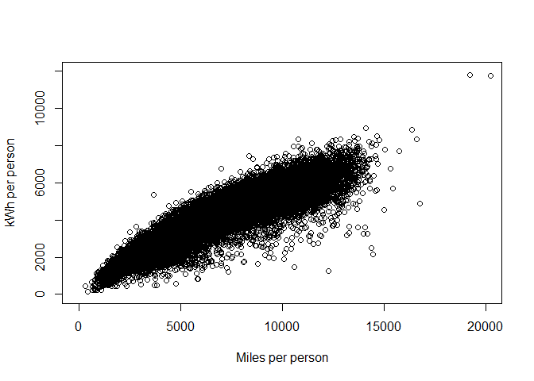<!-- -->

``` r
plot(predict(cars_lm5),all$driving_kwh_percap,
     xlab="predicted",ylab="actual", xlim = c(0,12000), ylim = c(0,12000))
abline(a=0,b=1, col = "red")
```

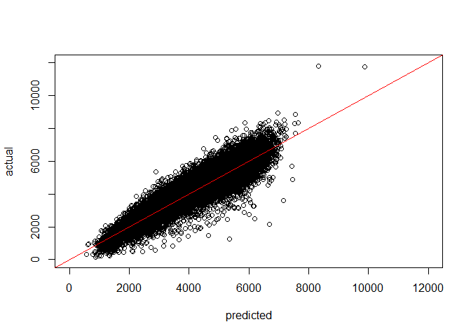<!-- -->
