Modeling spatial variation in energy use
================
Malcolm Morgan
11 June 2019

Setup
-----

Input data
----------

First load the data, some is England and Wales only so we will start with just there.

We will subets the data and join togther

Examining Correlations
----------------------

Let see which variaibles are correlated with energy use:

### Gas

A table of the top correlations

    ##                                  R  P
    ## SocGrade_DE.            -0.5639508  0
    ## NoCarsHH                -0.5361904  0
    ## miles_percap             0.5293108  0
    ## Whole_House_Detached.    0.5448550  0
    ## Self.Emp.                0.5490101  0
    ## TotDomGas_17_kWh         0.5555530  0
    ## TotDomGas_11_kWh         0.5595345  0
    ## X4plusCarHH.             0.5746058  0
    ## T2W_Home.                0.5819583  0
    ## X2CarHH.                 0.5860884  0
    ## Outright.                0.5998159  0
    ## median_household_income  0.6014278  0
    ## cars_percap              0.6019325  0
    ## X3CarHH.                 0.6153954  0
    ## SocGrade_AB.             0.6333509  0
    ## MeanDomElec_17_kWh       0.6604744  0
    ## MeanDomElec_11_kWh       0.6657689  0
    ## mean_bedrooms            0.7118405  0
    ## mean_rooms               0.7390212  0
    ## MeanDomGas_17_kWh        0.9806321  0
    ## MeanDomGas_11_kWh        1.0000000 NA

The strongest correlation is with the number of rooms. This is unsurprising as bigger houses require more heating. The next strongest correlation is with the number of bedrooms, but as the number of bedrooms is closely realted to the number of rooms this is not very informative.

We could try a model of the top 5 variaibles

``` r
# gas_lm0 = lm(MeanDomGas_11_kWh ~ mean_rooms + SocGrade_DE. + mean_bedrooms + SocGrade_AB. + median_household_income, data=all, na.action = na.exclude)
# summary(gas_lm0)
```

It would be more intresting to remove the affect of the number of rooms and see what is strongly correlated with the residuals.

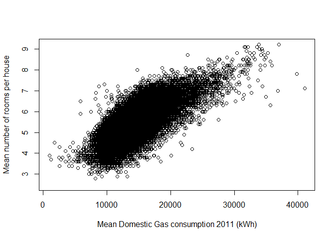

Lets look at what best predicts the residuals after accounting for the number of rooms.

    ## 
    ## Call:
    ## lm(formula = MeanDomGas_11_kWh ~ mean_rooms, data = all, na.action = na.exclude)
    ## 
    ## Residuals:
    ##      Min       1Q   Median       3Q      Max 
    ## -11862.3  -1503.8   -180.6   1245.3  21476.6 
    ## 
    ## Coefficients:
    ##             Estimate Std. Error t value Pr(>|t|)    
    ## (Intercept) -2695.61      87.22  -30.91   <2e-16 ***
    ## mean_rooms   3135.21      15.87  197.50   <2e-16 ***
    ## ---
    ## Signif. codes:  0 '***' 0.001 '**' 0.01 '*' 0.05 '.' 0.1 ' ' 1
    ## 
    ## Residual standard error: 2269 on 32413 degrees of freedom
    ##   (2338 observations deleted due to missingness)
    ## Multiple R-squared:  0.5462, Adjusted R-squared:  0.5461 
    ## F-statistic: 3.901e+04 on 1 and 32413 DF,  p-value: < 2.2e-16

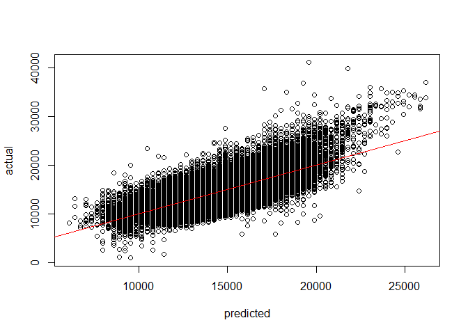

    ## Warning in sqrt(1 - h * h): NaNs produced

    ##                                  R  P
    ## SocGrade_C2.            -0.4422558  0
    ## PartTime.               -0.4161821  0
    ## Ptn_EE                  -0.3625546  0
    ## T2W_Passenger.          -0.3382974  0
    ## p5_12k                  -0.3311907  0
    ## mean_house_age          -0.3300233  0
    ## T2W_Car.                -0.3030392  0
    ## T2W_Train.               0.3010667  0
    ## Flat_Converted.          0.3018297  0
    ## pu5k                     0.3179919  0
    ## Self.Emp.                0.3297608  0
    ## T2W_Metro.               0.3357659  0
    ## median_household_income  0.3576429  0
    ## SocGrade_AB.             0.3728166  0
    ## TotDomGas_17_kWh         0.4425404  0
    ## TotDomGas_11_kWh         0.4904878  0
    ## MeanDomGas_17_kWh        0.6487635  0
    ## MeanDomGas_11_kWh        0.6736821  0
    ## gas_lm1_res              1.0000000 NA

Some of these are more realted to car use (e.g. T2W\_Car is the % of people travelling to work by car). Of the ones about houses SocialGrade\_C2 is the strongest correlation.

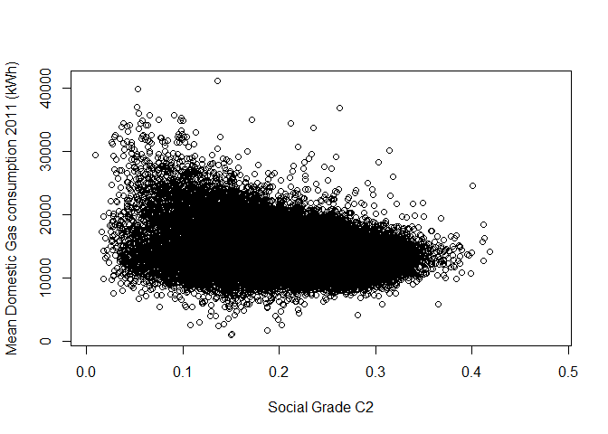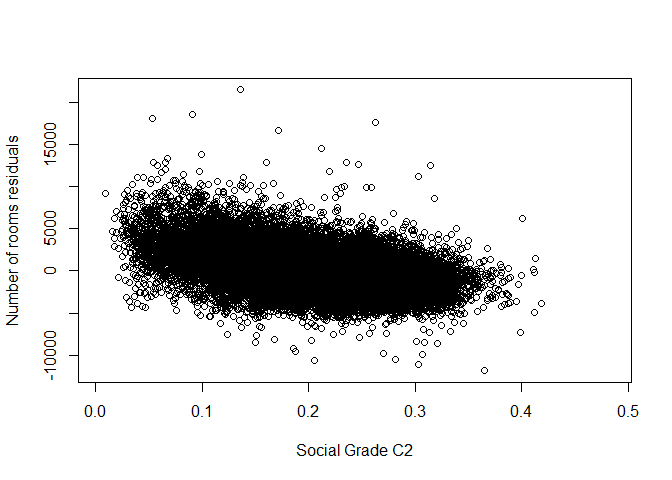

So let try a new model with the two variaibles

    ## 
    ## Call:
    ## lm(formula = MeanDomGas_11_kWh ~ mean_rooms + SocGrade_C2., data = all, 
    ##     na.action = na.exclude)
    ## 
    ## Residuals:
    ##      Min       1Q   Median       3Q      Max 
    ## -10705.8  -1307.9    -41.5   1215.1  20359.5 
    ## 
    ## Coefficients:
    ##               Estimate Std. Error t value Pr(>|t|)    
    ## (Intercept)     997.95      88.57   11.27   <2e-16 ***
    ## mean_rooms     3079.50      14.25  216.13   <2e-16 ***
    ## SocGrade_C2. -16040.29     180.47  -88.88   <2e-16 ***
    ## ---
    ## Signif. codes:  0 '***' 0.001 '**' 0.01 '*' 0.05 '.' 0.1 ' ' 1
    ## 
    ## Residual standard error: 2035 on 32412 degrees of freedom
    ##   (2338 observations deleted due to missingness)
    ## Multiple R-squared:  0.6351, Adjusted R-squared:  0.6351 
    ## F-statistic: 2.821e+04 on 2 and 32412 DF,  p-value: < 2.2e-16

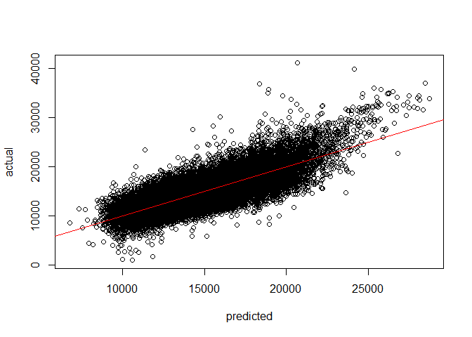

We can repete the process

    ## Warning in sqrt(1 - h * h): NaNs produced

    ##                             R  P
    ## Crr_EE             -0.2715051  0
    ## mean_house_age     -0.2480263  0
    ## p1993_99           -0.2224963  0
    ## p1983_92           -0.2139817  0
    ## Ptn_EE             -0.2061434  0
    ## pu5k                0.2087189  0
    ## MeanDomElec_11_kWh  0.2288647  0
    ## p1930_39            0.2330090  0
    ## MeanDomElec_17_kWh  0.2457997  0
    ## Self.Emp.           0.2507481  0
    ## TotDomGas_17_kWh    0.3593443  0
    ## TotDomGas_11_kWh    0.4049770  0
    ## MeanDomGas_17_kWh   0.5701297  0
    ## MeanDomGas_11_kWh   0.6040756  0
    ## gas_lm1_res         0.8966774  0
    ## gas_lm2_res         1.0000000 NA

Hear some ofther appropiate variaibles such as the EPC rating (Crr\_EE) and buidling age (mean\_house\_age) stand out as we the proortion of self empolyed people.

Let try a final model with all these added variaibles.

    ## 
    ## Call:
    ## lm(formula = MeanDomGas_11_kWh ~ mean_rooms + SocGrade_C2. + 
    ##     Crr_EE + Self.Emp. + mean_house_age, data = all, na.action = na.exclude)
    ## 
    ## Residuals:
    ##    Min     1Q Median     3Q    Max 
    ## -12473  -1171    -24   1099  18576 
    ## 
    ## Coefficients:
    ##                  Estimate Std. Error t value Pr(>|t|)    
    ## (Intercept)     1.883e+04  8.855e+02   21.26   <2e-16 ***
    ## mean_rooms      2.586e+03  1.782e+01  145.14   <2e-16 ***
    ## SocGrade_C2.   -1.331e+04  1.793e+02  -74.28   <2e-16 ***
    ## Crr_EE         -9.029e+01  2.911e+00  -31.02   <2e-16 ***
    ## Self.Emp.       1.433e+02  3.255e+00   44.03   <2e-16 ***
    ## mean_house_age -5.807e+00  5.305e-01  -10.95   <2e-16 ***
    ## ---
    ## Signif. codes:  0 '***' 0.001 '**' 0.01 '*' 0.05 '.' 0.1 ' ' 1
    ## 
    ## Residual standard error: 1879 on 32409 degrees of freedom
    ##   (2338 observations deleted due to missingness)
    ## Multiple R-squared:  0.689,  Adjusted R-squared:  0.6889 
    ## F-statistic: 1.436e+04 on 5 and 32409 DF,  p-value: < 2.2e-16

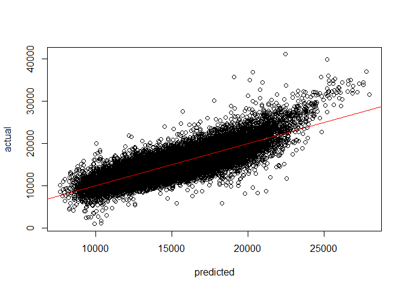

So we have a model that can explain 68.9% of the variation in gas usage at LSOA level based on just 5 variables.

Electricity
-----------

Lets Do the same for electricity

``` r
all_matrix <- all[,2:ncol(all)]
all_matrix <- data.matrix(all_matrix)

correlations <- rcorr(x = all_matrix, type="pearson")
```

    ## Warning in sqrt(1 - h * h): NaNs produced

``` r
correlations_elec <- data.frame(R = correlations$r[,"MeanDomElec_11_kWh"], P = correlations$P[,"MeanDomElec_11_kWh"])
correlations_elec <- correlations_elec[order(correlations_elec$R),]
correlations_elec <- correlations_elec[correlations_elec$R > 0.5 | correlations_elec$R < -0.5,]
correlations_elec
```

    ##                                  R  P
    ## NoCarsHH                -0.5585555  0
    ## pHeating_Gas            -0.5393354  0
    ## SocGrade_DE.            -0.5012241  0
    ## median_household_income  0.5121404  0
    ## cars_total               0.5502318  0
    ## cars_miles               0.5549160  0
    ## pHeating_Other           0.5834652  0
    ## Whole_House_Detached.    0.6017017  0
    ## TotDomElec_17_kWh        0.6059113  0
    ## mean_bedrooms            0.6144301  0
    ## X2CarHH.                 0.6153940  0
    ## TotDomElec_11_kWh        0.6265141  0
    ## cars_percap              0.6415059  0
    ## miles_percap             0.6415382  0
    ## Self.Emp.                0.6582675  0
    ## MeanDomGas_17_kWh        0.6592434  0
    ## MeanDomGas_11_kWh        0.6657689  0
    ## mean_rooms               0.6714863  0
    ## T2W_Home.                0.7067935  0
    ## X3CarHH.                 0.7274470  0
    ## X4plusCarHH.             0.7578176  0
    ## MeanDomElec_17_kWh       0.9618235  0
    ## MeanDomElec_11_kWh       1.0000000 NA

Here we se the top factors are (excluding car related ones) Number of rooms, Self Employed, and % gas heating, detached houses , and % other heating.

``` r
elec_lm0 = lm(MeanDomElec_11_kWh ~ mean_rooms + Self.Emp. + pHeating_Gas + Whole_House_Detached. + pHeating_Other, 
              data=all, na.action = na.exclude)
summary(elec_lm0)
```

    ## 
    ## Call:
    ## lm(formula = MeanDomElec_11_kWh ~ mean_rooms + Self.Emp. + pHeating_Gas + 
    ##     Whole_House_Detached. + pHeating_Other, data = all, na.action = na.exclude)
    ## 
    ## Residuals:
    ##     Min      1Q  Median      3Q     Max 
    ## -5122.7  -246.4   -22.1   211.9 13043.5 
    ## 
    ## Coefficients:
    ##                        Estimate Std. Error t value Pr(>|t|)    
    ## (Intercept)           2852.3637    30.6036   93.20   <2e-16 ***
    ## mean_rooms             729.0320     5.5752  130.76   <2e-16 ***
    ## Self.Emp.               48.5739     0.7518   64.61   <2e-16 ***
    ## pHeating_Gas           -37.4653     0.3477 -107.74   <2e-16 ***
    ## Whole_House_Detached.   -1.7549     0.1895   -9.26   <2e-16 ***
    ## pHeating_Other         -29.3248     0.4942  -59.34   <2e-16 ***
    ## ---
    ## Signif. codes:  0 '***' 0.001 '**' 0.01 '*' 0.05 '.' 0.1 ' ' 1
    ## 
    ## Residual standard error: 442.9 on 33836 degrees of freedom
    ##   (911 observations deleted due to missingness)
    ## Multiple R-squared:  0.7423, Adjusted R-squared:  0.7423 
    ## F-statistic: 1.95e+04 on 5 and 33836 DF,  p-value: < 2.2e-16

What about the residuals?

``` r
elec_lm1 = lm(MeanDomElec_11_kWh ~ mean_rooms, data=all, na.action = na.exclude)
summary(elec_lm1)
```

    ## 
    ## Call:
    ## lm(formula = MeanDomElec_11_kWh ~ mean_rooms, data = all, na.action = na.exclude)
    ## 
    ## Residuals:
    ##     Min      1Q  Median      3Q     Max 
    ## -4467.4  -418.9  -124.8   254.6 13927.4 
    ## 
    ## Coefficients:
    ##             Estimate Std. Error t value Pr(>|t|)    
    ## (Intercept)  141.716     24.001   5.905 3.57e-09 ***
    ## mean_rooms   723.225      4.339 166.696  < 2e-16 ***
    ## ---
    ## Signif. codes:  0 '***' 0.001 '**' 0.01 '*' 0.05 '.' 0.1 ' ' 1
    ## 
    ## Residual standard error: 646.5 on 33840 degrees of freedom
    ##   (911 observations deleted due to missingness)
    ## Multiple R-squared:  0.4509, Adjusted R-squared:  0.4509 
    ## F-statistic: 2.779e+04 on 1 and 33840 DF,  p-value: < 2.2e-16

``` r
plot(predict(elec_lm1),all$MeanDomElec_11_kWh,
     xlab="predicted",ylab="actual")
abline(a=0,b=1, col = "red")
```

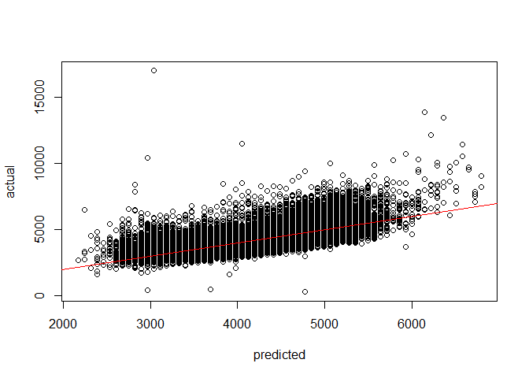

``` r
all$elec_lm1_res = residuals(elec_lm1, na.action = na.exclude)

all_matrix <- all[,2:ncol(all)]
all_matrix <- data.matrix(all_matrix)

correlations <- rcorr(x = all_matrix, type="pearson")
```

    ## Warning in sqrt(1 - h * h): NaNs produced

``` r
correlations_elec_res <- data.frame(R = correlations$r[,"elec_lm1_res"], P = correlations$P[,"elec_lm1_res"])
correlations_elec_res <- correlations_elec_res[order(correlations_elec_res$R),]
correlations_elec_res <- correlations_elec_res[correlations_elec_res$R > 0.3 | correlations_elec_res$R < -0.3,]
correlations_elec_res
```

    ##                             R  P
    ## pHeating_Gas       -0.6462009  0
    ## GasMet_11          -0.3454391  0
    ## Ptn_EE             -0.3285758  0
    ## GasMet_17          -0.3268685  0
    ## T2W_Passenger.     -0.3042407  0
    ## area_km             0.3019049  0
    ## Area_Hectares       0.3019049  0
    ## gas_lm2_res         0.3035521  0
    ## X4plusCarHH.        0.3290875  0
    ## gas_lm1_res         0.3489583  0
    ## T2W_Home.           0.4180408  0
    ## Self.Emp.           0.4495740  0
    ## pHeating_Other      0.4777340  0
    ## pHeating_Electric   0.5744553  0
    ## TotDomElec_17_kWh   0.5788952  0
    ## TotDomElec_11_kWh   0.5873605  0
    ## MeanDomElec_17_kWh  0.7123278  0
    ## MeanDomElec_11_kWh  0.7410170  0
    ## elec_lm1_res        1.0000000 NA

The top residuals are % of differnt heating types, self empoyed and working from home.

``` r
elec_lm2 = lm(MeanDomElec_11_kWh ~ mean_rooms + Self.Emp. + pHeating_Gas + pHeating_Electric + pHeating_Other + T2W_Home., 
              data=all, na.action = na.exclude)
summary(elec_lm2)
```

    ## 
    ## Call:
    ## lm(formula = MeanDomElec_11_kWh ~ mean_rooms + Self.Emp. + pHeating_Gas + 
    ##     pHeating_Electric + pHeating_Other + T2W_Home., data = all, 
    ##     na.action = na.exclude)
    ## 
    ## Residuals:
    ##     Min      1Q  Median      3Q     Max 
    ## -4970.8  -243.3   -25.8   208.3 12761.7 
    ## 
    ## Coefficients:
    ##                   Estimate Std. Error t value Pr(>|t|)    
    ## (Intercept)        12.8387    82.0284   0.157 0.875628    
    ## mean_rooms        676.5887     4.4479 152.114  < 2e-16 ***
    ## Self.Emp.          53.7831     1.1880  45.272  < 2e-16 ***
    ## pHeating_Gas       -5.3740     0.9104  -5.903 3.61e-09 ***
    ## pHeating_Electric  38.0635     0.9966  38.194  < 2e-16 ***
    ## pHeating_Other      6.4630     1.0600   6.097 1.09e-09 ***
    ## T2W_Home.          -7.5070     2.2616  -3.319 0.000903 ***
    ## ---
    ## Signif. codes:  0 '***' 0.001 '**' 0.01 '*' 0.05 '.' 0.1 ' ' 1
    ## 
    ## Residual standard error: 434.1 on 33835 degrees of freedom
    ##   (911 observations deleted due to missingness)
    ## Multiple R-squared:  0.7524, Adjusted R-squared:  0.7524 
    ## F-statistic: 1.714e+04 on 6 and 33835 DF,  p-value: < 2.2e-16

Driving
-------

Finally lets look at driving

``` r
all_matrix <- all[,2:ncol(all)]
all_matrix <- data.matrix(all_matrix)

correlations <- rcorr(x = all_matrix, type="pearson")
```

    ## Warning in sqrt(1 - h * h): NaNs produced

``` r
correlations_cars <- data.frame(R = correlations$r[,"miles_percap"], P = correlations$P[,"miles_percap"])
correlations_cars <- correlations_cars[order(correlations_cars$R),]
correlations_cars <- correlations_cars[correlations_cars$R > 0.5 | correlations_cars$R < -0.5,]
correlations_cars
```

    ##                                R  P
    ## NoCarsHH              -0.8863509  0
    ## Unemployed.           -0.6366630  0
    ## Occupancy_Rooms.      -0.6366251  0
    ## T2W_Bus.              -0.6327583  0
    ## Unemp_LongTerm.       -0.6060022  0
    ## dense_2017            -0.6010782  0
    ## PopDens               -0.5971902  0
    ## dense_2011            -0.5968010  0
    ## Flat_PurposeBuilt.    -0.5911419  0
    ## Age25to29.            -0.5861809  0
    ## pu5k                  -0.5797919  0
    ## SocGrade_DE.          -0.5600010  0
    ## Occupancy_Bedrooms.   -0.5589965  0
    ## Sick.                 -0.5522231  0
    ## Unemp_NeverWorked.    -0.5451175  0
    ## Unemp_16to24.         -0.5004581  0
    ## MeanDomGas_17_kWh      0.5134831  0
    ## Age_Median             0.5251467  0
    ## MeanDomGas_11_kWh      0.5293108  0
    ## Age60to64.             0.5503497  0
    ## T2W_Home.              0.5620300  0
    ## pmiles_diesel          0.5674552  0
    ## MeanDomElec_17_kWh     0.5906773  0
    ## pcars_diesel           0.5911316  0
    ## po12k                  0.5996106  0
    ## miles_av_o13           0.6069242  0
    ## Mortgage.              0.6146913  0
    ## Outright.              0.6219956  0
    ## Age45to59.             0.6369953  0
    ## MeanDomElec_11_kWh     0.6415382  0
    ## Whole_House_Detached.  0.7678345  0
    ## mean_bedrooms          0.7720605  0
    ## T2W_Car.               0.7780529  0
    ## X4plusCarHH.           0.7900675  0
    ## cars_total             0.8247643  0
    ## mean_rooms             0.8304508  0
    ## cars_miles             0.8715446  0
    ## X3CarHH.               0.8811794  0
    ## X2CarHH.               0.9225223  0
    ## cars_percap            0.9547231  0
    ## miles_percap           1.0000000 NA

The top correlataions are quite broad, but inclicde household without cars, unemployment, and population density, car ownership per capita, number of rooms and bedrooms, and % travel to work by car.

``` r
cars_lm0 = lm(miles_percap ~ cars_percap + T2W_Car. + NoCarsHH + Unemployed. + dense_2011, 
              data=all, na.action = na.exclude)
summary(cars_lm0)
```

    ## 
    ## Call:
    ## lm(formula = miles_percap ~ cars_percap + T2W_Car. + NoCarsHH + 
    ##     Unemployed. + dense_2011, data = all, na.action = na.exclude)
    ## 
    ## Residuals:
    ##     Min      1Q  Median      3Q     Max 
    ## -3640.0  -471.3   -44.8   411.6  4827.7 
    ## 
    ## Coefficients:
    ##               Estimate Std. Error t value Pr(>|t|)    
    ## (Intercept) -2.435e+03  5.962e+01 -40.836  < 2e-16 ***
    ## cars_percap  7.912e+03  3.237e+01 244.410  < 2e-16 ***
    ## T2W_Car.     3.646e+01  6.347e-01  57.448  < 2e-16 ***
    ## NoCarsHH     2.129e+01  8.932e-01  23.838  < 2e-16 ***
    ## Unemployed.  1.933e+01  2.612e+00   7.402 1.37e-13 ***
    ## dense_2011  -2.303e-02  1.299e-03 -17.729  < 2e-16 ***
    ## ---
    ## Signif. codes:  0 '***' 0.001 '**' 0.01 '*' 0.05 '.' 0.1 ' ' 1
    ## 
    ## Residual standard error: 757.7 on 34747 degrees of freedom
    ## Multiple R-squared:  0.923,  Adjusted R-squared:  0.923 
    ## F-statistic: 8.327e+04 on 5 and 34747 DF,  p-value: < 2.2e-16

``` r
plot(all$cars_percap, all$miles_percap,
     xlab="Cars per person",ylab="Miles per person",
     xlim = c(0,2), ylim = c(0,20000))
```

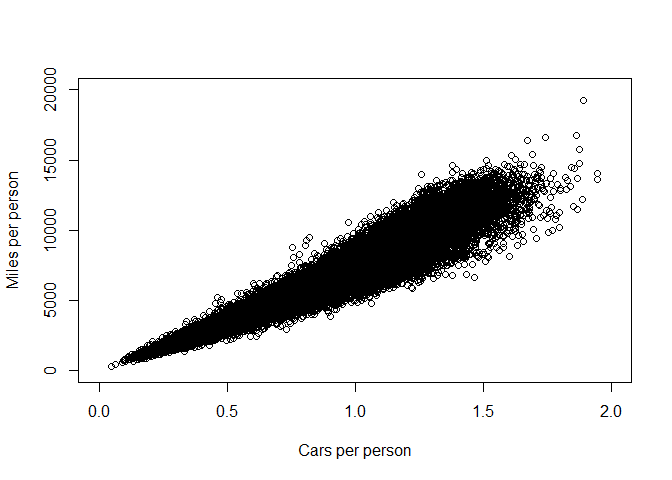

``` r
plot(predict(cars_lm0),all$miles_percap,
     xlab="predicted",ylab="actual", xlim = c(0,20000), ylim = c(0,20000))
abline(a=0,b=1, col = "red")
```

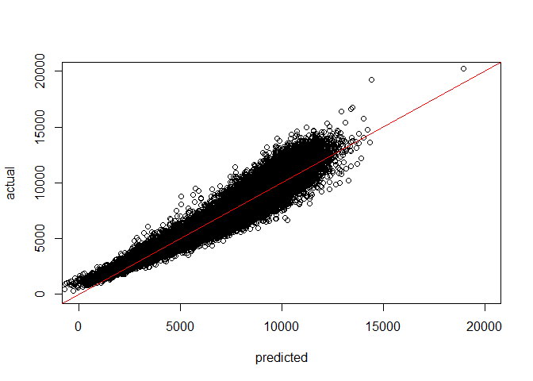

There is a very strong correlation between cars per person and miles driven per person, suggesting that a car owned is a car driven. It is perhaps unserprising that people do not own a lot of cars they don't need, conversly it is impossible to drive a non-esitant car. So lets remove the car ownerhip to get a learer idea of what else matters.

``` r
cars_lm1 = lm(miles_percap ~  T2W_Car. + NoCarsHH + Unemployed. + dense_2011, 
              data=all, na.action = na.exclude)
summary(cars_lm1)
```

    ## 
    ## Call:
    ## lm(formula = miles_percap ~ T2W_Car. + NoCarsHH + Unemployed. + 
    ##     dense_2011, data = all, na.action = na.exclude)
    ## 
    ## Residuals:
    ##    Min     1Q Median     3Q    Max 
    ##  -3971   -766   -176    586  96840 
    ## 
    ## Coefficients:
    ##               Estimate Std. Error  t value Pr(>|t|)    
    ## (Intercept)  9.492e+03  5.648e+01  168.051  < 2e-16 ***
    ## T2W_Car.     1.658e+01  1.038e+00   15.976  < 2e-16 ***
    ## NoCarsHH    -1.345e+02  1.032e+00 -130.397  < 2e-16 ***
    ## Unemployed.  2.511e+01  4.307e+00    5.832 5.53e-09 ***
    ## dense_2011  -3.329e-02  2.141e-03  -15.547  < 2e-16 ***
    ## ---
    ## Signif. codes:  0 '***' 0.001 '**' 0.01 '*' 0.05 '.' 0.1 ' ' 1
    ## 
    ## Residual standard error: 1249 on 34748 degrees of freedom
    ## Multiple R-squared:  0.7905, Adjusted R-squared:  0.7905 
    ## F-statistic: 3.279e+04 on 4 and 34748 DF,  p-value: < 2.2e-16

``` r
plot(predict(cars_lm1),all$miles_percap,
     xlab="predicted",ylab="actual", xlim = c(0,20000), ylim = c(0,20000))
abline(a=0,b=1, col = "red")
```

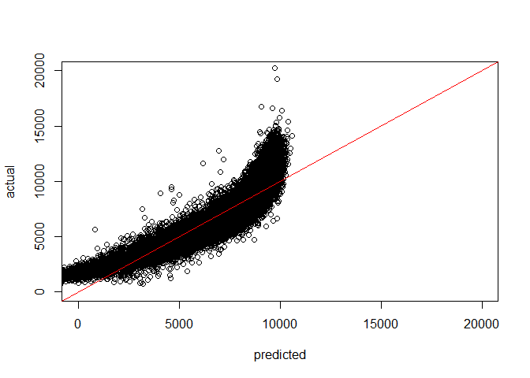

Still a reasonalby good fit (R^2 of 0.79), but there is some clear non-linerality to this relationship.

``` r
pairs(all[all$miles_percap < 30000,
          c("miles_percap", "T2W_Car.", "NoCarsHH" , "Unemployed.", "dense_2011")])
```


It seems that density has a non-linear effect on driving.

``` r
plot(all$dense_2011, all$miles_percap,
     xlab="People per km ^2",ylab="Miles per person",
     ylim = c(0, 20000))
```


``` r
# fit non-linear model
cars_lm2a = lm(miles_percap ~  dense_2011, data=all, na.action = na.exclude)
cars_lm2b = nls(miles_percap ~ a * exp(b * dense_2011), data = all, start = list(a = 8000, b = -7e-5),
                na.action = na.exclude)
cars_lm2c = lm(miles_percap ~ exp(-7.25e-5 * dense_2011), data=all, na.action = na.exclude)
summary(cars_lm2a)
```

    ## 
    ## Call:
    ## lm(formula = miles_percap ~ dense_2011, data = all, na.action = na.exclude)
    ## 
    ## Residuals:
    ##    Min     1Q Median     3Q    Max 
    ##  -7445  -1466    -88   1375  96374 
    ## 
    ## Coefficients:
    ##               Estimate Std. Error t value Pr(>|t|)    
    ## (Intercept)  8.344e+03  1.656e+01   503.8   <2e-16 ***
    ## dense_2011  -3.888e-01  2.804e-03  -138.7   <2e-16 ***
    ## ---
    ## Signif. codes:  0 '***' 0.001 '**' 0.01 '*' 0.05 '.' 0.1 ' ' 1
    ## 
    ## Residual standard error: 2190 on 34751 degrees of freedom
    ## Multiple R-squared:  0.3562, Adjusted R-squared:  0.3562 
    ## F-statistic: 1.922e+04 on 1 and 34751 DF,  p-value: < 2.2e-16

``` r
summary(cars_lm2c)
```

    ## 
    ## Call:
    ## lm(formula = miles_percap ~ exp(-7.25e-05 * dense_2011), data = all, 
    ##     na.action = na.exclude)
    ## 
    ## Residuals:
    ##    Min     1Q Median     3Q    Max 
    ##  -8031  -1352    -29   1297  96093 
    ## 
    ## Coefficients:
    ##                             Estimate Std. Error t value Pr(>|t|)    
    ## (Intercept)                  -711.30      48.45  -14.68   <2e-16 ***
    ## exp(-7.25e-05 * dense_2011)  9683.36      61.38  157.76   <2e-16 ***
    ## ---
    ## Signif. codes:  0 '***' 0.001 '**' 0.01 '*' 0.05 '.' 0.1 ' ' 1
    ## 
    ## Residual standard error: 2084 on 34751 degrees of freedom
    ## Multiple R-squared:  0.4173, Adjusted R-squared:  0.4173 
    ## F-statistic: 2.489e+04 on 1 and 34751 DF,  p-value: < 2.2e-16

If we put that back into the original model.

``` r
cars_lm3 = lm(miles_percap ~  T2W_Car. + NoCarsHH + Unemployed. +                  exp(-7.25e-5 * dense_2011), 
              data=all, na.action = na.exclude)
summary(cars_lm3)
```

    ## 
    ## Call:
    ## lm(formula = miles_percap ~ T2W_Car. + NoCarsHH + Unemployed. + 
    ##     exp(-7.25e-05 * dense_2011), data = all, na.action = na.exclude)
    ## 
    ## Residuals:
    ##    Min     1Q Median     3Q    Max 
    ##  -3789   -753   -176    573  96685 
    ## 
    ## Coefficients:
    ##                             Estimate Std. Error  t value Pr(>|t|)    
    ## (Intercept)                 7967.941     64.011  124.478  < 2e-16 ***
    ## T2W_Car.                      12.481      1.016   12.285  < 2e-16 ***
    ## NoCarsHH                    -129.086      1.013 -127.485  < 2e-16 ***
    ## Unemployed.                   21.968      4.208    5.221 1.79e-07 ***
    ## exp(-7.25e-05 * dense_2011) 1845.388     48.375   38.147  < 2e-16 ***
    ## ---
    ## Signif. codes:  0 '***' 0.001 '**' 0.01 '*' 0.05 '.' 0.1 ' ' 1
    ## 
    ## Residual standard error: 1228 on 34748 degrees of freedom
    ## Multiple R-squared:  0.7976, Adjusted R-squared:  0.7975 
    ## F-statistic: 3.422e+04 on 4 and 34748 DF,  p-value: < 2.2e-16

``` r
plot(predict(cars_lm3),all$miles_percap,
     xlab="predicted",ylab="actual", xlim = c(0,20000), ylim = c(0,20000))
abline(a=0,b=1, col = "red")
```

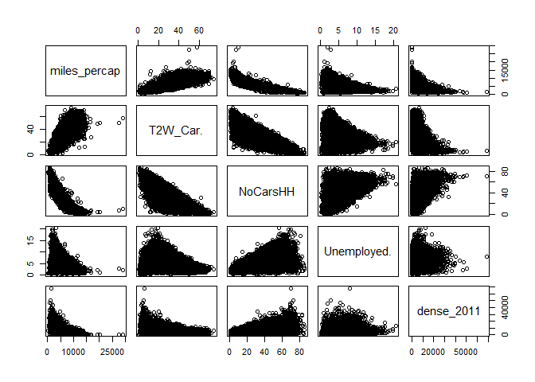

It didn't help very much :(

So try a polynomial on density and No car households

``` r
cars_lm4 = lm(miles_percap ~  T2W_Car. + poly(NoCarsHH, 2) + Unemployed. + poly(dense_2011, 2), 
              data=all, na.action = na.exclude)
summary(cars_lm4)
```

    ## 
    ## Call:
    ## lm(formula = miles_percap ~ T2W_Car. + poly(NoCarsHH, 2) + Unemployed. + 
    ##     poly(dense_2011, 2), data = all, na.action = na.exclude)
    ## 
    ## Residuals:
    ##    Min     1Q Median     3Q    Max 
    ## -10454   -560    -37    488  97246 
    ## 
    ## Coefficients:
    ##                        Estimate Std. Error t value Pr(>|t|)    
    ## (Intercept)           5.754e+03  3.372e+01  170.66   <2e-16 ***
    ## T2W_Car.              1.368e+01  8.719e-01   15.69   <2e-16 ***
    ## poly(NoCarsHH, 2)1   -4.275e+05  2.647e+03 -161.51   <2e-16 ***
    ## poly(NoCarsHH, 2)2    1.169e+05  1.122e+03  104.16   <2e-16 ***
    ## Unemployed.           1.041e+02  3.676e+00   28.32   <2e-16 ***
    ## poly(dense_2011, 2)1 -4.334e+04  1.413e+03  -30.67   <2e-16 ***
    ## poly(dense_2011, 2)2  3.043e+04  1.122e+03   27.12   <2e-16 ***
    ## ---
    ## Signif. codes:  0 '***' 0.001 '**' 0.01 '*' 0.05 '.' 0.1 ' ' 1
    ## 
    ## Residual standard error: 1049 on 34746 degrees of freedom
    ## Multiple R-squared:  0.8523, Adjusted R-squared:  0.8523 
    ## F-statistic: 3.343e+04 on 6 and 34746 DF,  p-value: < 2.2e-16

``` r
plot(predict(cars_lm4),all$miles_percap,
     xlab="predicted",ylab="actual", xlim = c(0,20000), ylim = c(0,20000))
abline(a=0,b=1, col = "red")
```

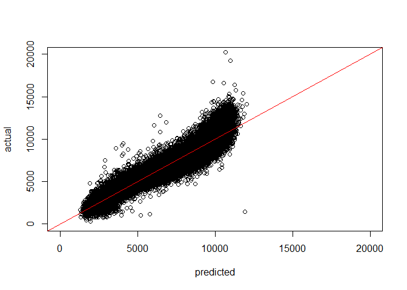

Mutch better but still seeing an S-bend to the data?
